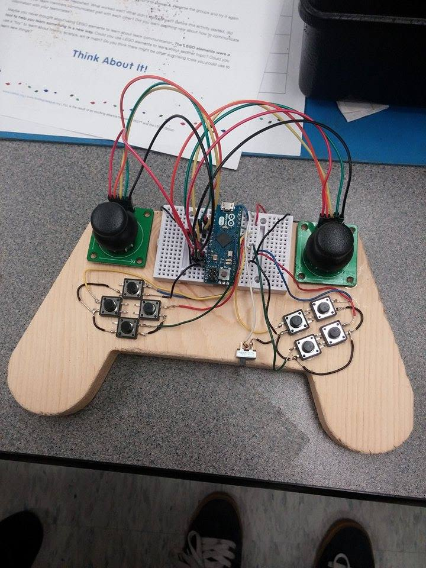
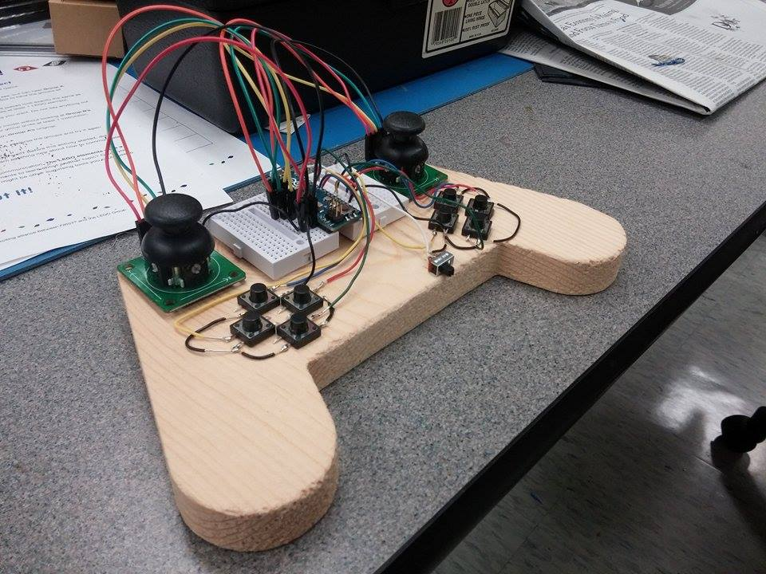

# E190U Lab 1: <small>Build a Gamepad Controller</small>
<address>Andy Russell</address>

## Introduction

In this lab, I constructed a video game controller with 10 buttons (4 for a
d-pad, 4 face buttons and 2 shoulder buttons), 2 joysticks, and a switch. All
components were attached to the wooden body of the controller by epoxy. The
buttons were attached electronically to an Arduino microcontroller by soldering
and a breadboard. The joysticks were attached by jumper wires.

## Design Methodology

When setting out to design this controller, I wanted to make a controller that
worked for the kinds of games that I like to play. I especially enjoy games from
the SNES and Game Boy Advance, I hoped to create a button layout that would
facilitate games from both consoles. I usually use a PS3 controller for these
types of games, but I am sometimes annoyed by the placement of the face buttons
because they don't line up well with my thumb. So, I improved the design by
rotating the buttons slightly, like a SNES controller. This is important because
many games rely on being able to push multiple buttons at the same time, so if
the buttons line up with your thumb, it becomes much more comfortable.

Another important consideration was the joystick placement. I think that the PS3
has a more comfortable stick layout compared to the Xbox 360 because the sticks
are at the same level. On the PS3, the sticks are located at the bottom of the
controller. However, since I wanted to prioritize the layout of the buttons and
d-pad, I put the sticks at the top of the controller, like the Wii U. I think
this is a fair compromise, as it is unlikely that I will be switching between
the joysticks and buttons very often.

I also placed the switch in a specific place. In the next lab, I hope to program
the controller to use the switch as turbo (that is, when the switch is on, any
held button inputs will act as rapid presses). The turbo switch is relatively
easy to access but will not get in the way of normal gameplay.

## Testing Methodology

To test the controller, I used the multimeter to connect the ground pin with
whatever pin was being used for each button or switch's input. If the connection
was correct, then there would be no connection unless the button was pushed. I
also verified that the connections held by connecting the multimeter to the
opposite side of whatever buttons were being tested, and then ensured that the
connection carried through any buttons that were connected in series.

## Results and Discussion

The controller turned out exactly as I wanted it to. The buttons feel great with
my thumb due to their angle, and it's easy to push multiple buttons at the same
time. Due to their height, the joysticks feel slightly awkward. I probably could
have fixed this issue if I took the time to embed the sticks into the wood.
However, I think that they are in a better position than if they were below the
buttons, because it's easier to drop your hands down to the buttons than to move
them up to the joysticks.

## Conclusions

I spent about an hour epoxying the buttons to the controller, and four hours
soldering and connecting the components. I think that overall the lab went well,
but I would have appreciated some additional instruction on where to obtain the
materials required for the lab, as I am a Pomona student unfamiliar with the
stock room. It also would have been helpful to have some more instruction on
soldering, as I'm not sure that I was doing it completely correctly.
