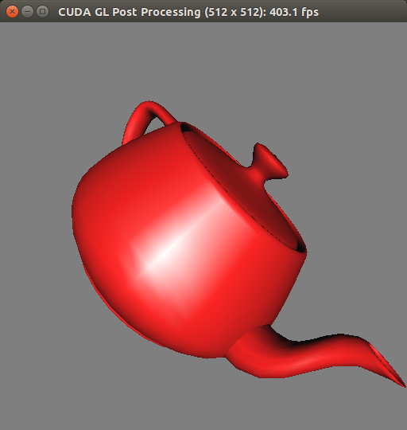
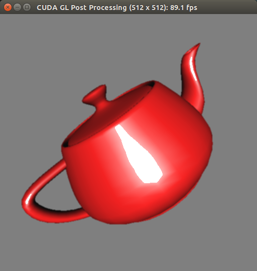
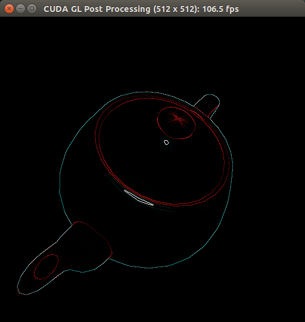
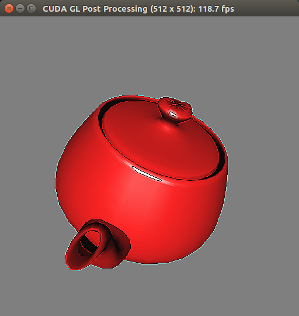
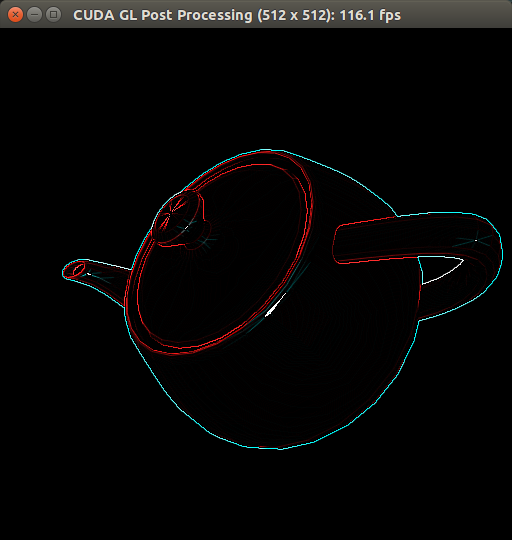

# E190U Lab 4: <small>Graphical Post-Processing</small>
<address>Andy Russell</address>

## Introduction

In this lab, I modified the CUDA postProcessGL demo to support convolution
matrices on the Jetson TK1.

I worked with Andrew Fishberg to modify the algorithm in the demo to use a
convolution matrix instead of using a radial box blur.

## Design Methodology

In image processing, it is possible to describe a large number of image
transformations with a convolution matrix (also called a kernel). Take the
following matrix:

```
0 0 0
0 1 0
0 0 0
```

Say we take an arbitrary pixel in an image. If we multiply each of the RGB
values of this pixel by the center element (the origin), then we get the
original values. We can then sum each of the RGB values of the surrounding
pixels by the surrounding elements of the kernel. Summing all of these values
together, we get the original pixel. Thus, this matrix is the identity kernel.
By using different values for our kernel, it is possible to make a wide range of
different image transformations.

My goal was to support a wide range of transformations while requiring as little
change to the original source as possible. Thus, I modified the source to
support using various convolution matrices instead of requiring a box blur
(though the source did not use a convulation matrix initially, the CUDA process
was essentially calculating a convolution).

## Testing Methodology

Thankfully, the demo makes it very easy to test different types of
post-processing. The user may toggle the CUDA processing on and off by pressing
spacebar, so it was possible to see the difference between no processing and the
matrix being tested almost instantly.

To see if my convolution matrices worked as expected, I simply visually compared
the image output from the demo to the image/kernel pairs provided on [the kernel
Wikipedia page][kernel-page].

I also modified the main function to start the radius of the convolution at 1,
as that is the only radius that works as expected (other radii invoke undefined
behavior by reading past the bounds of the convolution matrix).

## Results and Discussion

My modifications work as expected, however they are not as flexible as the
original demo. Because my kernels are hard-coded into the source, they only
support a kernel of radius one. It would be possible to support a dynamic
radius, but the kernels would have to be generated at runtime, rather than
compile time.

I augmented the demo with the following kernels:

```cuda
__device__ const float identity[][3] = {{0, 0, 0}, {0, 1, 0}, {0, 0, 0}};
__device__ const float boxBlur[][3] = {{1/9.0f, 1/9.0f, 1/9.0f}, {1/9.0f, 1/9.0f, 1/9.0f}, {1/9.0f, 1/9.0f, 1/9.0f}};
__device__ const float edgeDetect[][3] = {{0, 1, 0}, {1, -4, 1}, {0, 1, 0}};
__device__ const float sharpen[][3] = {{0, -1, 0}, {-1, 5, -1}, {0, -1, 0}};
__device__ const float alternateEdge[][3] = {{-1, -1, -1}, {-1, 8, -1}, {-1, -1, -1}};
```

Each of the kernels performs as expected, with the `edgeDetect` and `sharpen`
working particularly nicely. The `boxBlur` kernel looks almost exactly the same
as the original filter (though it uses a square filter instead of a radial one).

### Identity



### Box Blur



### Edge Detection



### Sharpen



### Alternate Edge Detection



## Conclusion

In total, I spent about 4 hours on this lab. Most of the time was dedicated to
understanding how the demo calculated the blur. I also encountered a few
problems with getting the kernel to play nice with the luminosity calculation,
as it was easy to accidentally post-process all of the pixels to white.

[kernel-page]: http://en.wikipedia.org/wiki/Kernel_%28image_processing%29#Details
